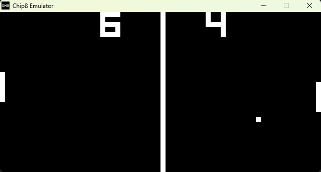

# CHIP-8 EMULATOR



This is a simple CHIP-8 emulator in C.
Roms can be opened both by dragging the file over the window
and dropping it, as well as, using the command line as:

``` bash
$ chip8 romfile.ch8
```

Support for more command line options and sound will be later on.

## Compatibility:

The program should compile on Windows and Linux and,
the binaries are available at https://github.com/amhue/chip8/releases.
