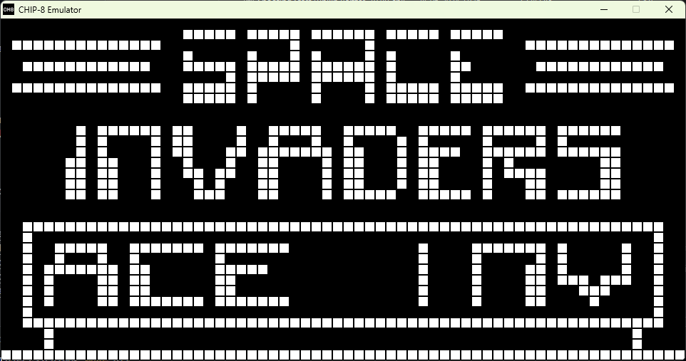
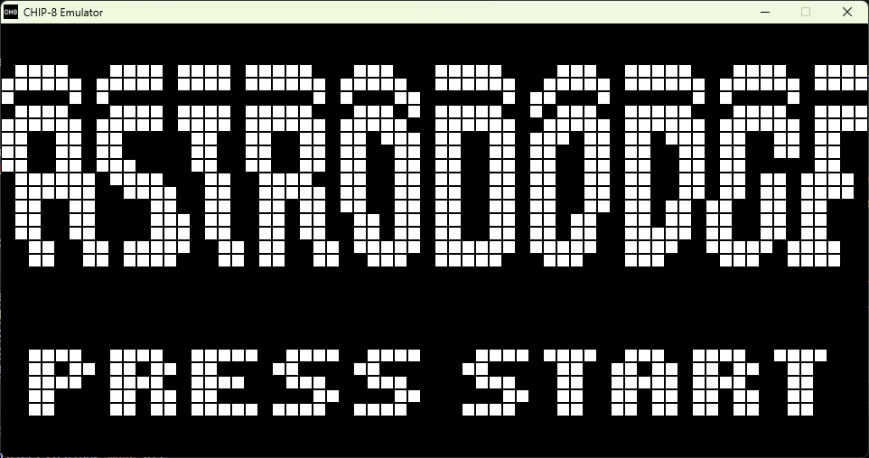
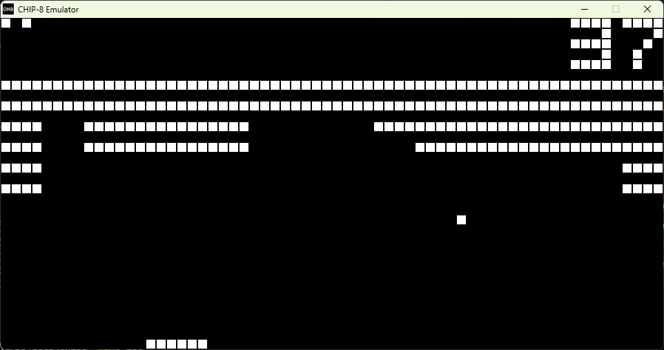
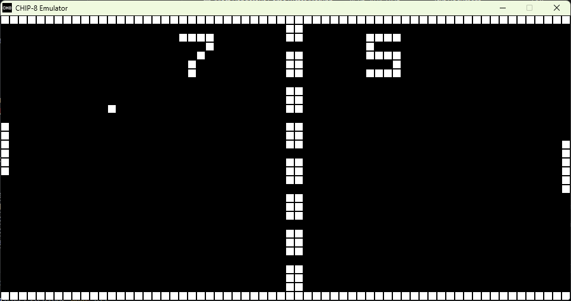

# CHIP-8 EMULATOR






This is a simple CHIP-8 emulator in C.
Roms can be opened both by dragging the file over the window
and dropping it, as well as, using the command line as:

``` bash
$ chip8 romfile.ch8
```

## Compatibility:

The program should compile on Windows and Linux and,
the binaries are available at https://github.com/amhue/chip8/releases.

## Building

Prerequisites:
- SDL2 library (instructions available at https://wiki.libsdl.org/SDL2/Installation).
- make
- gcc (mingw32 on windows)

And then run:

``` bash
$ make all
```

## Credits

I used the following resources for the project for reference
and debugging:

- http://devernay.free.fr/hacks/chip8/C8TECH10.HTM
- https://github.com/Timendus/chip8-test-suite
- https://github.com/dmatlack/chip8
- https://github.com/queso-fuego/chip8_emulator_c
- https://en.wikipedia.org/wiki/CHIP-8
